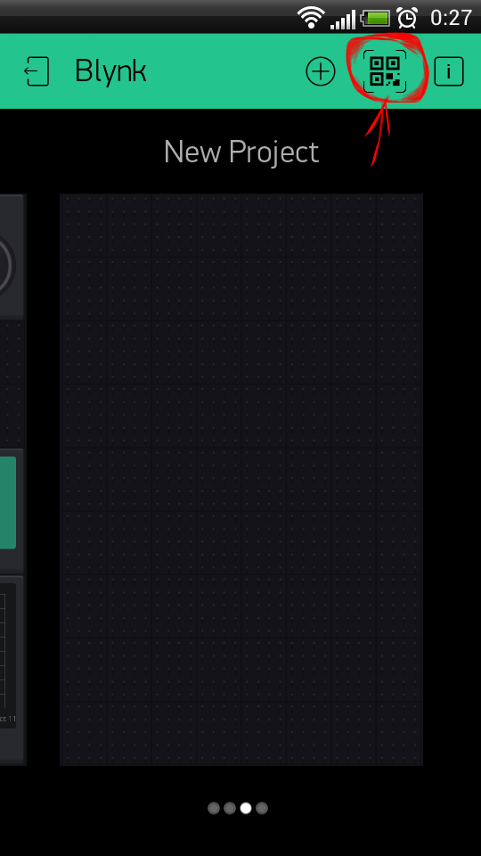

# Signaling-Blynk-Beta
Beta version

Прошивка создана для платы из этого проекта: https://easyeda.com/MihAlex/signaling-Arduino-SIM800L_copy

Статья по этому проекту https://pikabu.ru/story/gsmgprswifiblynk_signalizatsiya_na_arduino_6648404

**Обновления:**
12/01/2021

Плата NodeMcu:
* Реализована более удобная настройка сети при помощи библиотеки WiFiManager.
* Изменено приложение блинк. Добавлены новые функции, разделение датчиков на два контура отслеживания (например внутри дома и снаружи).
* Добавлена возможность автоматической постановки и снятия с охраны по отслеживанию нахождения телефона в зоне охраны по GPS датчику.
* Добавлена вкладка управления FM-радиоприёмником для прослушивания радио. Необходимо подключение динамика и радиомодуля RDA5807M.

Плата Ардуино:
* Изменён способ настройки датчиков. Вынесено в отдельный файл USER_sensors.h
* Добавлена поддержка беспроводных RC датчиков и пультов управления 433 МГц.
* Убрана функция управления электрозамком двери

05/09/2019

Плата NodeMcu:
* Добавлена синхронизация времени через интернет.
* В терминале Блинк указывается время прихода сообщения.

Плата Ардуино:
* Автоматическая настройка и синхронизация времени часов от NodeMcu и от SIM800L. 
* Добавлена callback функция для каждого датчика. При срабатывании датчика выполняется эта функция. Для каждого может быть своя.
* Добавлен массив ик-датчиков pult для управление сигнализацией с ИК пульта. При получении ик сигнала вызывается callback функция.
* Добавлена функция сирены. Для подключения звуковой и световой сирены через реле.
* Добавлена функция управлением реле закрытия и открытия двери с электрозамком (в квартие или автомобиле).

28/07/2019

В прошивку добавлен русский язык.
Теперь имена датчиков и сообщения можно писать на русском языке.
Принимать и отправлять смс на русском языке.

Плата NodeMcu:
* оптимизировано создание кнопок при старте
* добавлена поддержка кириллицы
* добавлена возможность отключения/включения датчика нажатием его кнопки (активна/неактивна). 

Плата Ардуино:
* добавлены приём и отправка смс на русском языке
* добавлено снятие/постановка на охрану по смс

28/05/2019

Плата NodeMcu:
* оптимизировано создание кнопок при старте 
* оптимизирована отправка DTMF команд через терминал

Плата Ардуино:
* реализовано автоопределение подключенных модемов
* исправлен баг с постановкой/снятием с охраны звонком с номера USER
* добавлены новые DTMF команды
* добавлена функция электронных часов на индикаторе TM1637

### На печатной плате могут разместиться:

* Arduino Nano V3.0. http://ali.pub/3unjp6
* NodeMcu v3 для выхода в интернет. http://ali.pub/3unjve и http://ali.pub/3unk02
* SIM800L для мобильной связи. http://ali.pub/3unkhk
* Радиомодуль NRF24L01 для приёма сигналов от беспроводных датчиков. http://ali.pub/3unkns
* ИК-приёмник.
* Датчик температуры DS18B20. http://ali.pub/3unl0m или http://ali.pub/3unkwc
* Термистор.
* Микроволновый датчик движения RCWL-0516. http://ali.pub/3unl9r
* Геркон. http://ali.pub/3unlem
* 7 сигментный индикатор часов TM1637. http://ali.pub/3unm16
* Зуммер. http://ali.pub/3unmkm
* Микрофон. http://ali.pub/3unmfk
* MOSFET транзисторы AO3400A для включения платы NodeMcu и внешних маломощных устройств. http://ali.pub/3unmrf
* Разъёмы для подключения других датчиков: http://ali.pub/3unnfj http://ali.pub/3unnj1 http://ali.pub/3unn7k http://ali.pub/3unnaa 
* Плата заряда литиевого аккумулятора. http://ali.pub/3unmx2
* Держатель для аккумулятора. http://ali.pub/3unofi

Кроме того, к свободным пинам могут подключаться любые другие ардуиносовместимые датчики и модули.

Cигнализация модульная, можно выбрать ту конфигурацию, которая нужна в данном случае. Она может работать с SIM800L или NodeMcu на выбор, либо с обоими модулями одновременно. В последнем случае имеет два независимых канала связи, что более надёжно.

### В состав проекта входят следующие скетчи:
* Скетч для Arduino Nano V3.0. Выполняет основные функции сигнализации.
https://github.com/wisenheimer/Signaling-Blynk/blob/master/Signalka/Signalka.ino
* Скетч для платы NodeMcu v3. Осуществляет управление Arduino через приложение на телефоне.
https://github.com/wisenheimer/Signaling-Blynk/tree/master/NodeMCU
* Скетч беспроводного датчика на модуле nRF24L01
https://github.com/wisenheimer/Signaling-Blynk/blob/master/nRF24sensor/nRF24sensor.ino
* Скетч беспроводного ИК-датчика
https://github.com/wisenheimer/Signaling-Blynk/blob/master/IRsensor/IRsensor.ino

## Сборка проекта

Для сборки проекта вам необходимо скачать ZIP архив с файлами проекта с этого сайта, и всё содержимое архива распаковать

Для Windows

* в папку Мои документы/Arduino/

Для Ubuntu

* Домашняя папка/Arduino

Затем необходимо установить недостающие библиотеки, настроить среду Arduino IDE, открыть скетч, подсоединить плату к компьютеру и прошить её.
Настройки датчиков производятся в самом скетче. Другие настройки осуществляются в файле настроек **Arduino/libraries/main_type/settings.h**

## Необходимые библиотеки и настройки среды Arduino IDE

Для прошивки платы NodeMCU устанавливаем библиотеку для esp8266. Как это сделать, можете почитать здесь https://smartmodules.ru/esp8266-arduino-ide

Для создания приложения Blynk скачиваем и устанавливаем последнюю Blynk library от сюда:

https://github.com/blynkkk/blynk-library/releases/latest

или через менеджер библиотек в Arduino IDE, ищем по слову Blynk.

Дополнительная информация о Blynk здесь:

Downloads, docs, tutorials: http://www.blynk.cc

Sketch generator:           http://examples.blynk.cc

Blynk community:            http://community.blynk.cc

Follow us:                  http://www.fb.com/blynkapp
                            http://twitter.com/blynk_app

Так же нам потребуется библиотека 1-Wire
https://github.com/PaulStoffregen/OneWire

В менеджере библиотек ищется по слову OneWire. Не путать с OneWireHub!!!

Для радиомодуля nRF24L01 https://github.com/nRF24/RF24

В менеджере библиотек называется RF24.

Для ИК-датчика и ИК-приёмника https://github.com/z3t0/Arduino-IRremote

В менеджере библиотек называется IRremote.

Для AM-приёмника 315/433 МГц https://github.com/sui77/rc-switch

В менеджере библиотек называется rc-switch от sui77.

Для 7 сигментного индикатора часов TM1637 https://github.com/Seeed-Studio/Grove_4Digital_Display

В менеджере библиотек называется Grove 4-Digit Display.

## Подключение 7 сегментного индикатора TM1637. Электронные часы

К плате Ардуино можно подключить 7 сигментный индикатор TM1637, на который будет выводиться текущее время. Нужен, если мы хотим поставить сигнализацию на видное место и замаскировать под электронные часы. Удобно при использовании беспроводных датчиков.

В файле настроек main_type/settings.h нужно разрешить его использование дефайном

>#define TM1637_ENABLE 1 // семисигментный индикатор для часов

И задать пины, к которым он будет подключен

>#define CLK 7         
>#define DIO 8

Индикатор берёт время из часов модема SIM800L. Если модем не получил точное время автоматически от оператора связи, то его можно настройть вручную стандартной для этого модема AT командой из его даташита.
Вид команды **AT+CCLK=time**

где **time** - время в формате **"yy/MM/dd,hh:mm:ss±zz"**

**zz** - часовой пояс.

Например, команда для времени 10 часов 1 минута 00 секунд 27 августа 2019 года, время Московское, будет выглядеть следующим образом:

**AT+CCLK="19/08/27,10:01:00+03"**

Эту команду нужно отправить по смс или через Блинк. Модем обновит своё текущее время. Затем нужно отправить DTMF команду синхронизации времени часов с временем модема **14#**. На дисплей начнёт выводиться текущее время.

При наличии платы NodeMcu часы автоматически получают время из интернета с периодической синхронизацией, интервал которой задаётся в main_type/settings.h
дефайном 

>// период синхронизации часов, мс
>#define SYNC_TIME_PERIOD 120000

## Создание приложения Blynk для телефона

Для начала вам нужно скачать на свой телефон приложение Blynk для Arduino, ESP8266,RPi

IOS:

https://itunes.apple.com/us/app/blynk-control-arduino-raspberry/id808760481?ls=1&mt=8

Android:

https://play.google.com/store/apps/details?id=cc.blynk

Войдите в приложение Blynk и нажмите кнопку QR в галерее проектов.

Отсканируйте этот QR код.

После сканирования будет создан новый Проект, все виджеты, настройки, макет будут клонированы. Вам потребуется достаточно энергии для клонирования этого проекта.
К бесплатным 2000 энергии докупите ещё 5000.

## Настройка приложения Blynk

**вкладка ГЛАВНАЯ**

### Триггер GPS

**"Виджет Триггер GPS позволяет легко инициировать события, когда вы входите или выходите из географической зоны. Этот виджет будет работать в фоновом режиме и периодически будет проверять ваши координаты. Если ваше местоположение находится в пределах или вне указанной зоны (географическая зона выбирается на карте виджета), виджет отправит команду HIGH/LOW на аппаратное устройство."**

Мы будем использовать этот виджет для автоматической постановки/снятия сигнализации с охраны. Для правильной работы виджета на телефоне должно быть включено отслеживание местоположения по GPS.

Настройка очень проста. Устанавливаем рычажок в положение EXIT. На карте находим свой город и выбираем радиус отслеживания. При выходе за этот радиус сигнализация будет поставлена на охрану. При нахождении в радиусе снята с охраны.

### Настройка контуров охраны

Позволяет выбрать контур отслеживания для каждого датчика в отдельности.

Каждый датчик может входить в один из двух контуров отслеживания (0 или 1). Это позволяет разбить датчики на две независимых группы, и включать/отключать одной кнопкой сразу все датчики, входящие в контур. Например, 0 контур - это датчики внутри дома, 1 контур - наружные датчики, и датчики двери/окон. Сняв с охраны 0 контур, можно находиться в доме, при этом внешний периметр дома останется под охраной.

Для настройки контуров охраны **после включения сигнализации** на главной вкладке нажмите кнопку **ИЗМЕНИТЬ**. На экране появится список всех датчиков и именем датчика и номеров контура. При нажадии на любой из дачик номер контура изменится с 0 на 1 или наборот.

На вкладке **НАСТРОЙКИ** есть кнопки включения/отключения каждого контура.

**Вклада НАСТРОЙКИ**

### кнопка СИРЕНА

Если используется сирена, подключенная через реле к плате NodeMcu, то установите в настройках кнопки номер цифрого пина, который управляет переключением реле.

## Настройка платы NodeMcu v3 после прошивки

Подключим плату к домашней WiFi. Для этого перезагрузите плату нажатием кнопки RESET, после чего в первые 2 секунды нажать и удерживать кнопку FLASH. 
Плата перейдёт в режим точки доступа. Необходимо подключиться к этой точке доступа, и ввести логин и пароль вашей Wi-Fi сети и токен Blynk устройства.

Для этого выполняем следующие шаги:

1. Используя любое устройство с поддержкой WiFi и браузер, подключитесь к вновь созданной точке доступа и введите адрес 192.168.4.1.

2. На экране у вас будет два варианта подключения к существующей сети:

• Настроить WiFi

• Настроить WiFi (без сканирования)

3. Выберите сеть, созданную платой NodeMcu и введите пароль. В поле Token впишите токен вашего Blynk устройства. Затем сохраните и дождитесь перезапуска ESP.

Теперь при включении плата NodeMcu будет автоматически подключаться к вашей домашней Wi-Fi сети и соединяться с сервером Blynk.

## Настройка сирены

Сигнализация позволяет использовать любой пин для управдения реле, которое будут включать звуковую сирену в случае тревоги.
Для подключения функции в файле с настроками settings.h установить дефайн в 1

>**#define SIRENA_ENABLE 1**

Затем указать пин ардуины, к которому будет подключено реле.

>// пины включения сирены

>**#define  SIREN_RELAY_PIN	9  // реле подключено к пину 9**

Так же нужно указать тип реле. Реле могут включаться как от высокого уровня, так и от низкого.

>// 1 - включение единицей HIGH

>// 0 - включение нулём LOW

>**#define SIREN_RELAY_TYPE 	0**

При срабатывании датчиков в режиме **Тревога** включится реле сирены. По завершению режима **Тревога**, или при снятии с охраны сигнализации, реле автоматически выключится.
Разрешающие флаги отобразятся в приложении Blynk. Там можно запретить сирену.

## Зарезервированные номера пинов arduino nano
(см. https://github.com/wisenheimer/Signaling-Blynk/blob/master/libraries/main_type/main_type.h):

#define	RING_PIN  2 // отслеживает вызовы с модема

#define	POWER_PIN 3 // отслеживает наличие питания

#define	DOOR_PIN  4 // датчик двери (геркон). Один конец на GND, второй на цифровой пин arduino.
К этому же пину подключён встроенный датчик температуры DS18B20. При совместном использовании датчиков геркон должен быть только NC типа (нормально закрытый).
При использовании геркона NO типа (нормально открытый), необходимо подключить его к любому другому свободному пину.		      

#define	BOOT_PIN  5 // перезагрузка модема SIM800L

#define RADAR_PIN 6 // микроволновый датчик движения RCWL-0516

### Пины для подключения модуля RF24L01 по SPI интерфейсу

#define	CE_PIN    9

#define	CSN_PIN   10

#define	MO_PIN    11

#define	MI_PIN    12

#define	SCK_PIN   13

### Для ИК-приёмника

#define RECV_PIN  11

### Зуммер (пищалка)
#define BEEP_PIN  A2

#	НАСТРОЙКА ДАТЧИКОВ

Перед прошивкой платы Ардуино необходимо заполнить файл USER_sensors.h в папке Signalka, где описываются параметры подключенныч датчиков.

Для каждого датчика необходимо заполнить структуру SENSOR_INIT_PARAM (прототип структуры описан в файле /libraries/main_type/main_type.h) для каждого датчика.

Параметры структуры:

**1. Тип датчика** (см. /libraries/Sensor/sensor.h):

>**DHT11, DHT21, DHT22** - Датчики температуры DHT11, DHT21 и DHT22 соответсвенно.

>**DS18B20** - датчик температуры DS18B20.

>**TERMISTOR** - датчик температуры - термистор.

>**DIGITAL_SENSOR** - датчик с одним цифровым выходом, состояние которого при срабатывании меняется с 0 на 1 или наоборот.

>**ANALOG_SENSOR** - аналоговый датчик, на выходе которого напряжение плавно изменяется в определённом диаппазоне.

>**IR_SENSOR** - беспроводной датчик с ик диодом.

>**RF24_SENSOR** - беспроводной датчик RF24L01.

>**RC_SENSOR** - беспроводной датчик 433 МГц.

**2. Уникальное имя датчика** (будет выводиться в отчётах и в приложении Blynk).

**3.** 
>Для **DIGITAL_SENSOR** это уровень на цифровом пине в спокойном режиме (LOW или HIGHT, 0 или 1).

>Для беспроводных датчиков кодовое слово, передаваемое при срабатывании.
  
>Для всех остальных датчиков значение срабатывания датчика.

**4. callback функция.** Будет выполнена при срабатывании датчика. Если такой функции нет, пишем NULL.

**5. Пин ардуино**

## Примеры описания датчиков:

Подробнее смотрите файл USER_sensors.h

### Все датчики, где на выходе либо низкий, либо высокий логический уровень
  
Геркон. Для него зарезервирован 4 пин ардуины DOOR_PIN

**DIGITAL_SENSOR, door, 1, alarm_on, DOOR_PIN**

>где **DIGITAL_SENSOR** - тип датчика

>**door** - строка с именем датчика. Как задать имя датчика, смотрите в файле USER_sensors.h
  
>**1** - начальное состояние пина датчика.
  
>**alarm_on** - callback функция без параметров **void alarm_on()** (или любая другая).
  
>**DOOR_PIN** - пин ардуины, к которому подсоединён датчик.
  
Датчик движения RCWL-0516 с начальным состоянием пина 0. Для него зарезервирован 6 пин ардуины RADAR_PIN.

**DIGITAL_SENSOR, rcwl0516, 0, alarm_on, RADAR_PIN**
	
Датчик огня. Начальное состояние на пине 1.

**DIGITAL_SENSOR, fire, 1, alarm_on, pin**

	где **fire** - уникальное имя датчика
  
	**pin** - номер пина, к которому подключен датчик.
  	
Датчики температуры **DHT11**, **DHT21**, **DHT22**, **DS18B20**, **TERMISTOR**.

Датчик температуры DS18B20 распаян на плате на пине 4 (DOOR_PIN).

**DS18B20, temp, 50, alarm_on, DOOR_PIN**

где **DS18B20** - тип датчика для ds18b20

	**temp** - имя переменной, хранящей строку с именем датчика.
  
	**50** - верхняя температура срабатывания датчика. Нижняя равна 0. Можно изменить, см. файл USER_sensors.h

Датчик температуры термистор заведён на плате на пин А7.

**TERMISTOR, term, 50, alarm_on, A7** 

### Датчики с аналоговым выходом

Пример аналогового датчика - датчик газа MQ-2. Значение на его пине изменяется от 0 до 1023.
Такие датчики должны быть подключены к аналоговым пинам ардуины A0-A7.

**ANALOG_SENSOR, mq2, 500, alarm_on, A0**

где **ANALOG_SENSOR** - тип датчика

	**mq2** - строка с именем датчика
  
	**500** - порог срабатывания.
  
	**alarm_on** - callback функция.
  
	**A0** - аналоговый пин ардуины, к которому подсоединён датчик.

### Беспроводные датчики:
	
Так как они физически не подключены к сигнализации, номер пина не указывается.
Всего 4 параметра.

Датчик с передающим ик-диодом

**IR_SENSOR, ir, 0xFFFFFFFF, alarm_on**

где **IR_SENSOR** - тип датчика

	**ir** - строка с именем датчика
  
	**0xFFFFFFFF** - 32 разрядное число. Любой код, который передаёт датчик.
  
	**alarm_on** - callback функция.
	
Датчик с передающим модулем RF24L01

**RF24_SENSOR, rf24, 0xFFFFFFFF, alarm_on**

где **RF24_SENSOR** - тип датчика

	**rf24** - строка с именем датчика
  
	**0xFFFFFFFF** - 32 разрядное число. Любой код, который передаёт датчик.
  
	**alarm_on** - callback функция.
	
Датчик с радиомодулем 433 МГц. RC-модуль. А так же RC-пульт.

**RC_SENSOR, rс, 0xFFFFFFFF, alarm_on**

где **RС_SENSOR** - тип датчика

	**rс** - строка с именем датчика
  
	**0xFFFFFFFF** - 32 разрядное число. Любой код, который передаёт датчик.
  
	**alarm_on** - callback функция.

Пример обработки команды RC пульта 433 МГц

**RC_SENSOR, button1, 0xFFFFFFFF, guard_on**

где **RС_SENSOR** - тип датчика

	**button1** - строка с именем кнопки
  
	**0xFFFFFFFF** - 32 разрядное число. Любой код, который передаёт пульт.
  
	**guard_on** - callback функция постановки сигнализации на охрану.

## Примеры сообщений от сигнализации
В ответном смс

номер звонившего (админа)
>AT+CMGS="+79xxxxxxxxx"

При исчезновении внешнего питания, и переходе сигнализации на работу от аккумулятора, придёт смс
>Svet OFF
При появлении внешнего питания придёт сообщение
>Svet ON

состояния флагов (1 - вкл, 0 - выкл).
>GUARD=1 EMAIL=0 TEL=1 SMS=1

где **GUARD** - флаг охраны

**EMAIL** - флаг разрешения отправки сообщений по e-mail

**TEL** - флаг разрешения звонков

**SMS** - флаг разрешения отправки сообщений по sms.

>DOOR:0 FIRE:0 RADAR:1

названия и флаг срабатываний всех датчиков (1 - сработал).

Ответ оператора на USSD запрос:
>+CUSD: 0, "Balance:27,60r", 15

## Управление сигнализацией

Управление сигнализацией осуществляется через приложение Blynk, отправкой смс, или DTMF команд непосредственно во время звонка на модем SIM800L.

**Внимание! Звонить и слать смс можно только с номеров, записанных в телефонную книгу симкарты.**
**Примечание! Все смс команды можно отправлять через терминал приложения Blynk. Ответы так же будут приходить в терминал.**

Если на симкарте уже есть номера, то их владельцы являются пользователями, которые могут включать и отключать сигнализацию. Перед использованием удалите ненужные номера. Администратором считается номер с именем **ADMIN** (все буквы заглавные). Если на симкарте нет такого номера, то первый позвонивший незарегистрированный пользователь станет Администратором. Его номер будет занесён в телефонную книгу.

Администратор — единственный пользователь, который может отправлять DTMF и смс команды.

Для удалённого добавления пользователя в телефонную книгу Администратор должен отправить смс вида

>**AT+CPBW=,"+xxxxxxxxxxx",145,"USER"**

>где +xxxxxxxxxxx - номер телефона

>USER - имя абонента

Модем настроен на поднятие трубки при звонке только с номера Админа. Это сделано для возможности использовать DTMF команды. Звонки с других номеров будут сбрасываться.

### SMS с телефона Админа

**Охрана 1** или **Guard 1** - постановка на охрану

**Охрана 0** или **Guard 0** - снятие с охраны

Для переключения состояния пинов Ардуины отправьте смс вида
**pin НОМЕР_ПИНА on/off**

Например, **pin 14 on** и **pin 14 off** задают пину 14 (А0) значения HIGH или LOW соответственно.
Поддерживаются пины от 5 до 19, где 14 соответствует А0, 15 соответствует А1 и т.д. 

**Внимание! Пины A6 и A7 не поддерживаются, т.к. они не работают как цифровые выходы.**

#### Отправка AT команд модему SIM800L.

Модем можно настраивать AT командами из его даташита. Для этого надо отправить в сигнализацию смс с AT командой с телефона Админа.

### DTMF команды

**Примечание. DTMF команды можно так же отправлять через терминал приложения Blynk**

Администратор может отправлять DTMF команды из списка ниже. Если команда принята, сигнализация сбросит звонок. Отчёт о выполнении команды придёт на почту или смс. Любая команда представляет собой цифру и знак **#**, который означает завершение ввода. После этого модем завершит звонок и выполнит полученную команду.

### 1#
GUARD_ON - постановка на охрану. Устанавливает флаг GUARD в 1.
### 2#
GUARD_OFF - снятие с охраны. Устанавливает флаг GUARD в 0.
### 3#
EMAIL_ON_OFF - включить/отключить GPRS/EMAIL. Меняет состояние флага EMAIL.
### 4#
SMS_ON_OFF - включить/отключить SMS. Меняет состояние флага SMS.
### 5#
TEL_ON_OFF - включить/отключить звонок при тревоге. Меняет состояние флага TEL.
### 6#
GET_INFO - сбор и отправка всех данных датчиков

Пример ответного смс:

>AT+CMGS="+79xxxxxxxxx"
>GUARD=1 EMAIL=0 TEL=1 CONNECT=0 SMS=1
>DOOR:0 FIRE:0 RADAR:1

### 7#
EMAIL_ADMIN_PHONE - отправляем на почту номер админа
### 8#
ADMIN_NUMBER_DEL - админ больше не админ
### 9#
MODEM_RESET - перезагрузка модема
### 10#
ESP_RESET - перезагрузка платы NodeMCU ESP8266
### 11#
BAT_CHARGE - показывает заряд батареи в виде строки
          +CBC: 0,100,4200
          где 100 - процент заряда
          4200 - напряжение на батарее в мВ.
### 12#
SIREN_ON_OFF - включить/отключить использование сирены

Кроме того, возможно выполнение любого USSD запроса, поддерживаемого оператором мобильной связи.
Например, запрос баланса *100#
Наберите 100# (знак * вводить не нужно).

В ответном смс

>AT+CMGS="+79xxxxxxxxx" - номер звонившего (админа)

>+CUSD: 0, "Balance:27,60r", 15 - ответ оператора

# Вкладка РАДИО

Сигнализацию можно превратить в радиоприёмник при помощи простого FM-модуля RDA5807M, который подключается к плате NodeMCU по шине I2C и управляется через приложение Blynk. Выход радиоприёмника подключается к усилителю колонок, или на аудиоразъём наушников. В качестве антенны можно использовать кусок проволоки. Питание от 3,3В.
Можно пользоваться автопоиском радиостанций, или задать свой список частот в скетче.
Микроконтроллер запоминает последнюю воспроизводимую радиостанцию из списка, и автоматически настроится на неё в следующий раз.

Подробнее про радиомодуль можно почитать здесь https://tsibrov.blogspot.com/2019/11/rda5807m-part1.html

# Проблемы и способы их устранения
## SIM800L не отправляет e-mail
Возможные причины:

**1. Не определён оператор связи.**

При загрузке модем SIM800L определяет оператора свзязи и отправляет в порт его имя, которое можно посмотреть в терминале в режиме отладки. Например

>+COPS: 0,0,"Bee Line GSM"

>OK

Имёна известных операторов и пароли для GPRS соединения перечислены в файле https://github.com/wisenheimer/Signaling-Blynk/blob/master/libraries/modem/modem.cpp

>ADD_OP(0, "MTS",     "mts");

>ADD_OP(1, "MEGAFON", "gdata");

>ADD_OP(2, "MegaFon", "gdata");

>ADD_OP(3, "Tele2",   "");

>ADD_OP(4, "MOTIV",   "");

>ADD_OP(5, "Beeline", "beeline");

>ADD_OP(6, "Bee Line", "beeline");

В массиве ниже должно быть столько же операторов, сколько перечисленно выше.

>const OPERATORS op_base[] PROGMEM = {

>{op_0, user_0},

>{op_1, user_1},

>{op_2, user_2},

>{op_3, user_3},

>{op_4, user_4},

>{op_5, user_5},

>{op_6, user_6}

>};

Если вашего оператора нет в списке, или написание его имени отличается, необходимо добавить его в список/отредактировать имеющуюся запись.

После этого появится возможность отправлять e-mail по GPRS.

Сообщите мне имя своего оператора связи, чтобы я добавил его в базу.

**2. Проблема в операторе связи. Он рвёт соединение.**

- модем не дружит с этой конкретной симкой, попробовать с другой, желательно другого оператора

- не подходящий тариф

- не достаточно денег на счету.

**3. Проблема с почтовым ящиком.**

- Не отправляет письма. Решение: создать другую почту на Яндекс, и попробовать с ней.

- Не отображает русский текст в письмах. Решение: отправлять письма на другой почтовый сервис, например Gmail.
